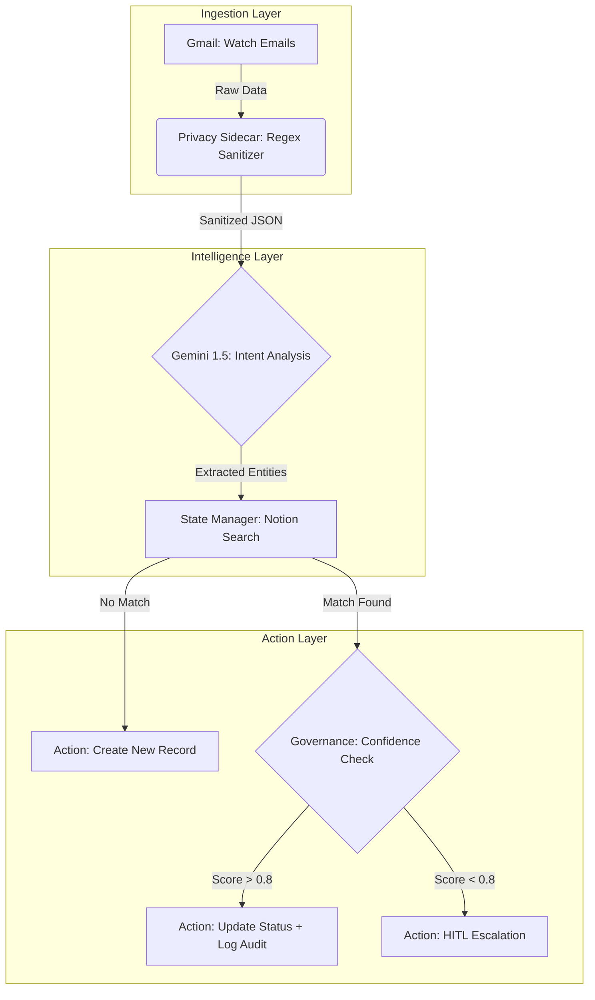

# 🚀 Smart Job Application Tracker (AI-Powered)
**Architected for Privacy, Governance, and Scalability**

> **Status:** Production-Ready (v1.0)
> **Stack:** Make.com, Google Gemini 1.5 Pro, Gmail, Notion, Regex
> **Pattern:** GPS Protocol (Governance, Privacy, State)

## 📖 Executive Summary
This project is not just a "job tracker." It is a demonstration of **Secure AI Architecture**.

While many automations carelessly pass sensitive data to LLMs, this framework implements a **Liability Control Plane**. It automates the extraction, analysis, and state-management of job applications while strictly adhering to Data Privacy (PII Redaction) and Governance (Audit Trails) standards.

## 💰 Business Value & ROI Analysis
* **Problem:** Manual application tracking takes ~5 minutes per job (Context switching, copy-pasting, data entry).
* **Scale:** For 100 applications/month, this equals ~8.3 hours of manual labor.
* **Solution:** This automation reduces time-per-application to **0 minutes** (fully passive).
* **ROI:** Saves **~100 hours/year** of high-value focused time, allowing for more networking and interview prep.
* **Operational Cost:** ~$1.50/month (Make.com Core Plan + Gemini Flash Token usage).

## 🏗️ System Architecture
The system operates on a **Sidecar Architecture**, separating the "Data Plane" (Gmail/Notion) from the "Intelligence Plane" (Gemini) via a Sanitization Proxy.

## 🌟 Key Features
* **Zero-Trust Privacy: ** All PII (Emails, Phone Numbers) is redacted locally before reaching the AI model.
* **Idempotency: ** "Search-Before-Write" logic prevents duplicate database entries.
* **Explainable AI (XAI): ** Every status change logs a "Reasoning" field, auditing why the AI made the decision.

## 🚀 Roadmap (Phase 2: Market Intelligence)
Currently architecting the "Pull" layer:

1. **Passive Monitoring:** Scrapers for target company career pages.
2. **Semantic Matching:** Vector-based comparison of Job Descriptions vs. Resume.
3. **Command Center:** A "Detected Opportunities" board for Human-in-the-Loop approval.

## 🛠️ Installation & Setup
1. Clone the Repo: git clone https://github.com/bananya267/state_aware_job_tracker.git
2. Import Blueprint: Upload blueprints/job-tracker-v1.json to your Make.com account.
3. Configure Environment:
   * Set GMAIL_LABEL to your specific job folder.
   * Set NOTION_DB_ID to your tracking database.
   * Add GEMINI_API_KEY to your Make keychain (Do not hardcode).
4. Review Policies: See GOVERNANCE.md for compliance details.
